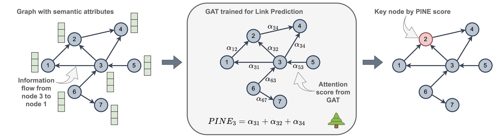
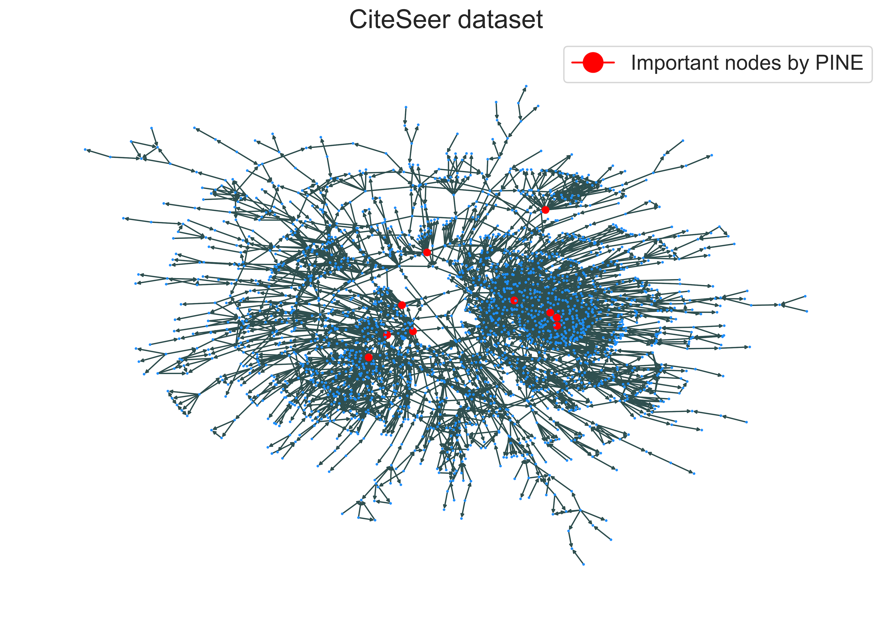

# PINE🌲: Pipeline for Important Node Exploration in Attributed Networks

PINE is an unsupervised approach for identifying important nodes in attributed networks. Importance of nodes is considered within an Influence Maximization (IM) paradigm. In the context of IM, the nodes are vital if they cause a great information spread in the network when a knowledge dissemination starts from them. PINE allows to effectively account for node features to discover crucial nodes from topology and attribute perspectives. PINE framework includes training of Graph Attention Network (GAT) to solve Link Prediction task for a subsequent use of attention distribution in node importance estimation. A presence of learning component is a key difference from the traditional centrlaity measures, like Degree Centrality or PageRank. 



In summary, the result of PINE work is an identified set of important nodes in view of graph structure and node attributes:



# 🚀 Launch PINE

To run PINE on your attributed network, follow steps below.

### Step 1. Set environment
To start, create conda environment with the name 'pine_env' with proper dependencies by running: 
```
conda env create --file=environment.yml
```
Then, activate it:
```
conda activate pine_env
```
Also, add the root path of this repo to PYTHONPATH.


### Step 2. Get data

We provide the studied datasets in [https://drive.google.com/drive/folders/10gtjmNtiOMKBSQ906t3lUIx4OXF7mQkD?usp=share_link](https://drive.google.com/drive/folders/10gtjmNtiOMKBSQ906t3lUIx4OXF7mQkD?usp=share_link). There are six attributed datasets: Cora, CiteSeer, PubMed, Wiki-CS, HEP-TH, and DBLP.
To download all of them into folder `data`, run:
```
bash bin/get_data.sh
```

### Step 3. Prepare data

We convert all datasets to the dict format with an unified structure. The datasets, like Cora, CiteSeer, PubMed, and Wiki-CS, come with already prepared embeddings for text attributes in nodes. For some datasets, we get embeddings for text features with the help of the pretrained models from HuggingFace. So, for HEP-TH dataset we use [PhysBERT](https://huggingface.co/thellert/physbert_cased), and for DBLP dataset we leverage [SPECTER](https://huggingface.co/allenai/specter2_regression).
To prepare datasets and save them into folder `prepared_data`, run:
```
bash bin/prepare_data.sh
```

The resulting dicts have node id as a key and information on that node as a value. Information on each node include:
* `emb` - an embedding vector of a text attribute of a node
* `out` - list of nodes for which the considered node is an information supplier. It means that there is a knowledge flow from the considered node to each node from the list.

### Step 4. Run methods

A folder `src/baselines` includes different methods for ealuation of node importance. A folder `src/pine` contains an implementation of our approach PINE, entaling a train process of attention-bassed graph network on Link Prediction task. Noteworthy, there are no need in any external markup, as Link Prediction is an unsupervised task. 

#### Output of methods
A goal of each method is to assign each node with an importance score calculted with the predefined rule. The larger assigned score the more important the node is considered to be in the network. The limitation of baseline approaches is their exclusive focus on structural properties. However, to estimate an importance of each node in the attributed network comprehensively, we need to account for information in node features. PINE is capable of doing that. 

#### Evaluation of results
To compare method performance, we adopt simulation-based procedure. Each methods associates importance scores with nodes. Then, top-K nodes are taken as seed node for the start of information diffusion process. At the end, an influence spread over the network is evaluated. The method is better than others if it identifies nodes, which lead to the greatest spread of information. 

#### Simulation models
As we consider attributed networks, it is important to simulate information propagation taking into account node attributes. To do this, each edge of the graph is associated with topology and attribute weghts. Then, these weights are used in such simulaiton models as **Linear Threshold (LT)** and **Independent Cascade (IC)**. We mark them as **LT+** and **IC+** to indicate their attribute-awareness. The implementations of simulation models are given in a folder `src/simulation`: [**LT+**](src/simulation/LT_plus.py), [**IC+**](src/simulation/IC_plus.py) .

#### Launch all methods
To run methods:
```
python src/run_methods.py
```

In `src/run_methods.py`, you need to specify a path to a dataset, a number of seed nodes (`num_starts`) for initiation of diffusion process, and a number of simulation runs `num_runs` (there will be `num_runs` simulation runs for each value of `num_starts`). 

As an output, you will get a dict in `results` folder, with the keys `lt` and `ic`, denoting a propagation model. For each propagation model, there are names of the considered methods and the corresponding values of influence spread. A number of influence spread values for each method is defined by a number of values in `num_starts`. 

#### Results
Table with the resulting influence spread values when use different methods to select influential starting nodes. Top-100 nodes are selected as seed nodes. The performance is reported within respect to two diffusion models **LT+** and **IC+**.

| **Dataset** | **Simulation model**           | **Degree** | **Out-degree**    | **Weighted out-degree**      | **Relative out-degree**      | **DSLI** | **PageRank**      | **Katz** | **VoteRank++**    | **EnRenew**       | **BII** | **PINE (ours)** |
|:--------:|:--------------:|:----------:|:-----------------:|:-----------------:|:-----------------:|:--------:|:-----------------:|:--------:|:-----------------:|:-----------------:|:-------:|:-----------------:|
|  **Cora**     |  **LT+** | 0.312      | 0.321             | 0.314             | 0.325             | 0.064    | 0.286             | 0.320    | 0.323             | 0.328 | 0.274   | **0.331**    |
|   | **IC+** | 0.083      | 0.083             | **0.086**    | 0.085 | 0.045    | 0.076             | 0.082    | 0.084             | 0.079             | 0.072   | **0.086**    |
| **CiteSeer**     | **LT+** | 0.203      | 0.245             | 0.246             | 0.253             | 0.187    | 0.260             | 0.256    | 0.257             | 0.261 | 0.235   | **0.281**    |
|     | **IC+** | 0.073      | 0.080             | 0.085 | 0.083             | 0.074    | 0.084             | 0.081    | 0.083             | 0.080             | 0.077   | **0.088**    |
| **PubMed**     | **LT+** | 0.078      | 0.106             | 0.091             | 0.103             | 0.064    | **0.117**    | 0.100    | 0.096             | 0.081             | 0.063   | 0.110 |
|      | **IC+** | 0.022      | 0.027             | 0.027             | 0.027             | 0.020    | 0.028 | 0.024    | 0.027             | 0.018             | 0.015   | **0.032**  |
| **Wiki-CS**     | **LT+** | 0.772      | 0.809 | 0.809 | 0.795             | -        | **0.812**    | -        | 0.691             | 0.764             | 0.402   | 0.801             |
|     | **IC+** | 0.069      | 0.077             | 0.077             | 0.077             | -        | 0.085 | -        | 0.059             | 0.054             | 0.022   | **0.092**    |
| **HEP-TH**     | **LT+** | 0.206      | 0.233             | 0.234             | 0.231             | -        | **0.321**    | -        | 0.246             | 0.289             | 0.224   | 0.316 |
|      | **IC+** | 0.023      | 0.026             | 0.026             | 0.026             | -        | 0.037             | -        | 0.041 | 0.029             | 0.021   | **0.047**    |
| **DBLP**     | **LT+** | 0.143      | 0.160             | 0.158             | 0.161             | 0.141    | 0.163 | 0.160    | 0.131             | 0.158             | 0.148   | **0.169**    |
|     | **IC+** | 0.035      | 0.039             | 0.039             | 0.040 | 0.035    | 0.037             | 0.037    | 0.035             | 0.034             | 0.031   | **0.044**    |

